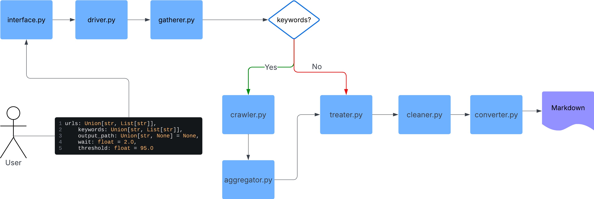
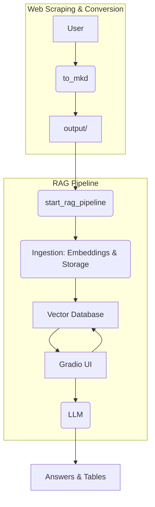

# Web Scraper with AI — HTML to Markdown for LLMs

Este projeto é uma biblioteca Python que realiza Web Scraping inteligente com lógica fuzzy e converte páginas HTML em Markdown simplificado, ideal para Large Language Models (LLMs) e análises posteriores.

---

## 🚀 Funcionalidades

- Web scraping automatizado com Selenium e suporte a páginas dinâmicas
- Conversão precisa de HTML para Markdown limpo com suporte a:
  - Títulos, parágrafos, listas, links, tabelas, blocos de código, entre outros
- Lógica de busca fuzzy para identificar se o conteúdo da página e páginas ao seu redor está relacionado às palavras-chave desejadas
- Mecanismo de retorno automático de páginas visitadas
- Pode ser utilizado como biblioteca ou como script principal

---

## 🧠 Como Funciona

### 🔍 Web Scraping com Selenium

O módulo utiliza o `undetected-chromedriver` e `selenium-stealth` com o ``selenium`` para navegar por páginas web, extrair conteúdos e retroceder após a coleta. O conteúdo das páginas é tratado pelo `BeautifulSoup` e convertido em Markdown por um parser customizado.

### 🧪 Lógica Fuzzy

A comparação entre o conteúdo da página e as palavras-chave fornecidas é feita com `RapidFuzz`, utilizando similaridade textual (ex: token_sort_ratio). Isso permite validar se a página realmente trata do tema buscado, mesmo que o texto não seja exatamente igual.

---

## 🖼️ Fluxo do Processo


</img>


### 🧪 Instalação

**Com pip**
```bash
pip install pymandua
```


**Ou alternativamente**
1. **Clone o repositório:**
```bash
git clone https://github.com/Mark-Campanella/pymandua.git
cd pymandua
```

2. **Crie um ambiente virtual e ative:**
```bash
python -m venv env
source env/bin/activate  # Linux/macOS
env\Scripts\activate     # Windows
```

3. **Instale as dependências:**
``` bash
pip install -r requirements.txt
```


### 🔧 Uso como script
```python
from pymandua import to_mkd

result = to_mkd(
    urls="https://pt.wikipedia.org/wiki/Luís_XIV_de_França",
    keywords=["Luís XIV", "França", "Rei Sol"],
    output_path=r"projeto/output",
    wait=2,
    threshold=90
)
print(result)

```

**Uso como CLI**
```bash
to-mkd --urls "https://exemplo.com" --keywords "palavra1,palavra2" --output "saida.md" --wait 2 --threshold 95
```

### 🧩 Estrutura do Projeto
```
├── pymandua/              # Módulo principal
│   ├── interface.py       # Interface principal do conversor
│   ├── converter.py       # Conversor de HTML para Markdown
│   ├── gatherer.py        # Web scraper e parser de conteúdo
│   ├── driver.py          # Inicializador de driver para o selenium
│   ├── crawler.py         # Web crawler e parser de conteúdo
│   ├── treater.py         # Prepara para o cleaner
│   ├── aggregator.py      # Agrega os diversos HTMLs resultantes em um para ser convertido
│   ├── cleaner.py         # Parser e limpador de conteúdo não necessário
├── output/                # Arquivos .mkd gerados
├── requirements.txt       # Dependências
├── main.py                # Exemplo de uso
```

**📚 Referências**
- [Selenium Docs](https://selenium-python.readthedocs.io)
- [BeautifulSoup Docs](https://www.crummy.com/software/BeautifulSoup/bs4/doc/)
- [RapidFuzz Docs](maxbachmann.github.io/RapidFuzz/)
- [RapidFuzz Examples](https://github.com/rapidfuzz/RapidFuzz#examples)

----------

### 🧠 RAG Pipeline (Análise com IA)
Este projeto estende sua funcionalidade principal com um pipeline de Análise de Conteúdo usando `Retrieval-Augmented Generation (RAG)`. Ele permite que você use os arquivos Markdown gerados para consultas inteligentes, respondendo perguntas e gerando tabelas estruturadas sobre o conteúdo.

### 🚀 Funcionalidades Chave do RAG
- Modularidade "Plug & Play": Alterne facilmente entre diferentes provedores de LLM (``Ollama, OpenAI, Gemini``) e bancos de dados vetoriais (``ChromaDB, Pinecone``) com a simples alteração de um parâmetro.

- Interface Web (UI): Uma interface interativa e amigável, criada com ``Gradio``, que se abre automaticamente no navegador para uma experiência de uso otimizada.

- Geração de Tabelas: Peça ao LLM para extrair dados específicos e formatá-los em uma tabela Markdown com cabeçalhos personalizados, ideal para análise.

### 🔧 Uso do Pipeline RAG
O pipeline RAG é um processo separado da conversão de HTML para Markdown, permitindo que você use a biblioteca de forma modular.

#### Passo 1: Gerar os Arquivos Markdown

Primeiro, use a função ``to_mkd`` para gerar os arquivos Markdown no diretório de saída (configurado em ``config.yaml``). Seus arquivos .mkd servirão como a base de conhecimento para o sistema RAG.

```python
from pymandua import to_mkd

# This will generate the .mkd files in the 'output' directory
to_mkd(
    urls=["https://pt.wikipedia.org/wiki/Luís_XIV_de_França"],
    keywords=["Luís XIV"],
    wait=2,
    threshold=90
)
```
### Passo 2: Iniciar o Pipeline RAG

Em seguida, use a nova função ``start_rag_pipeline`` para processar os arquivos Markdown existentes e iniciar a interface de usuário. Você pode usar as configurações padrão do ``config.yaml`` ou sobrescrevê-las com parâmetros diretos para maior flexibilidade.

```python
from pymandua import start_rag_pipeline

# Example 1: Use default settings from config.yaml
start_rag_pipeline()


# Example 2: Override models and providers via code
start_rag_pipeline(
    llm_model="llama3-chatqa:8b",
    embedding_model="nomic-embed-text",
    active_provider="ollama",
    persist_directory="./my-rag-db"
)

```

### 🖼️ Fluxo de Processo Completo
O diagrama de fluxo do seu projeto agora é expandido para incluir o pipeline RAG, ilustrando o processo completo da web até a análise com IA.

